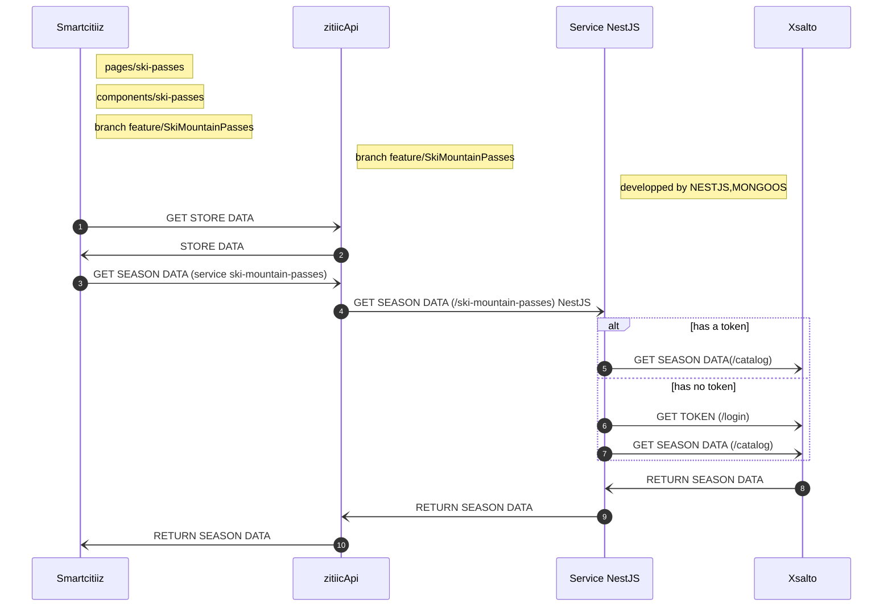

# schema of ski passes init

```mermaid

sequenceDiagram
    autonumber
    participant A as Smartcitiiz
    Note right of A: pages/ski-passes
    Note right of A: components/ski-passes
    Note right of A: branch feature/SkiMountainPasses
    participant B as  zitiicApi
    Note right of B: branch feature/SkiMountainPasses
    participant C as Service NestJS
    Note right of C: developped by NESTJS,MONGOOS
    participant D as Xsalto
    A-)B: GET STORE DATA
    B-)A: STORE DATA
    A-)B: GET SEASON DATA (service ski-mountain-passes)
    B-)C: GET SEASON DATA (/ski-mountain-passes) NestJS
    alt has a token
        C-)D: GET SEASON DATA(/catalog) 
    else has no token
        C-)D: GET TOKEN (/login) 
        C-)D: GET SEASON DATA (/catalog) 
    end
    D-)C: RETURN SEASON DATA
    C-)B: RETURN SEASON DATA
    B-)A: RETURN SEASON DATA

```
